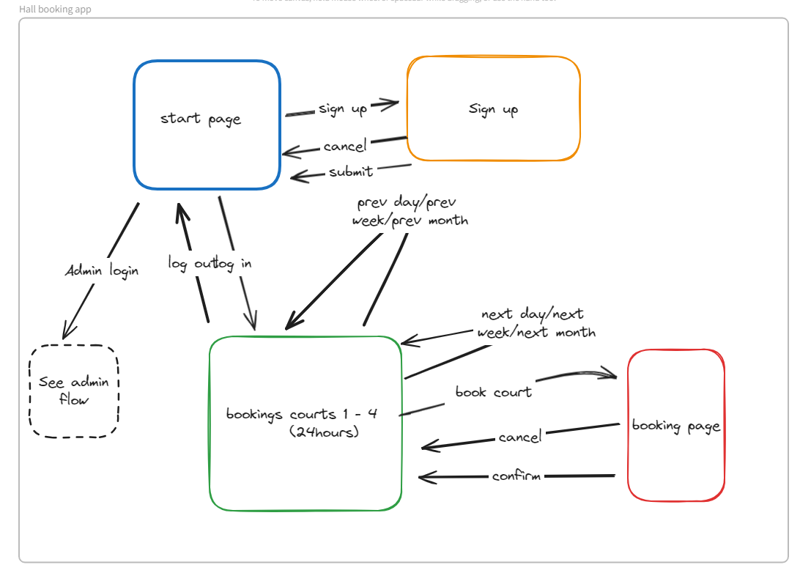

# Development of a Database-Driven Web Application for NCEA Level 3

Project Name: **Richmond hall booking app**

Project Author: **YUUKI HEISSNER**

Assessment Standards: **91902** and **91903**

-------------------------------------------------

## Design, Development and Testing Log

### 17/05/2024

I am designing my database and navigations of the website/app.  

> Replace this text with any user feedback / comments

Replace this text with notes describing how you acted upon the user feedback: made changes to design, etc.

This will be the general flow of the website for users. 

### 23/05/2024

The admin will have a different log in, when the admin logs in the admin flow will look like this. 

### 24/05/2024

I started working on my UI on figma to start testing the layouts and colours. 

> Replace this text with any user feedback / comments

### 28/05/2024

Replace this test with what you are working on

Replace this text with brief notes describing what you worked on, any decisions you made, any changes to designs, etc. Add screenshots / links to other media to illustrate your notes where necessary.

> Replace this text with any user feedback / comments

Replace this text with notes describing how you acted upon the user feedback: made changes to design, etc.

### DATE HERE

Replace this test with what you are working on

Replace this text with brief notes describing what you worked on, any decisions you made, any changes to designs, etc. Add screenshots / links to other media to illustrate your notes where necessary.

> Replace this text with any user feedback / comments

Replace this text with notes describing how you acted upon the user feedback: made changes to design, etc.

### DATE HERE

Replace this test with what you are working on

Replace this text with brief notes describing what you worked on, any decisions you made, any changes to designs, etc. Add screenshots / links to other media to illustrate your notes where necessary.

> Replace this text with any user feedback / comments

Replace this text with notes describing how you acted upon the user feedback: made changes to design, etc.

### DATE HERE

Replace this test with what you are working on

Replace this text with brief notes describing what you worked on, any decisions you made, any changes to designs, etc. Add screenshots / links to other media to illustrate your notes where necessary.

> Replace this text with any user feedback / comments

Replace this text with notes describing how you acted upon the user feedback: made changes to design, etc.
