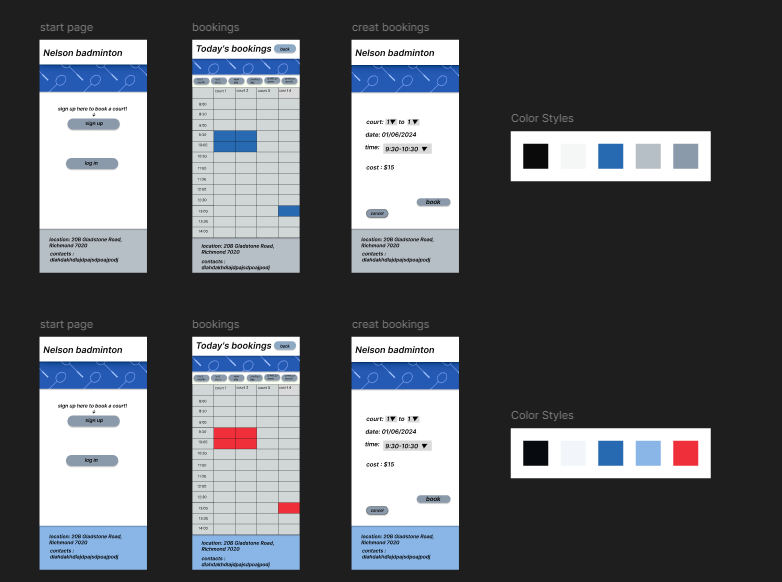

# Development of a Database-Driven Web Application for NCEA Level 3

Project Name: **Richmond hall booking app**

Project Author: **YUUKI HEISSNER**

Assessment Standards: **91902** and **91903**

-------------------------------------------------

## Design, Development and Testing Log

### 17/05/2024

I am designing my database and navigations of the website/app.  

This will be the general flow of the website for users. 

### 23/05/2024

The admin will have a different log in, when the admin logs in the admin flow will look like this. 

My end user was happy on all the functions I had on my flow diagram. 

### 24/05/2024

I started working on my UI on figma to start testing the layouts and colours. 

>

### 28/05/2024

I have been working on figma designing my UI. 

### 31/05/2024

I have completed the UI design on figma and now waiting on a response frm my end user on the functions and design. 

the basic functions are that users can login/sign up/logout. they can go straight to the bookings and choose a time and book an court. 

### 07/06/2024

I made some more variations of my app/website so that there are more options for my end-user if they don't like the initial design.   

### DATE HERE

Replace this test with what you are working on

Replace this text with brief notes describing what you worked on, any decisions you made, any changes to designs, etc. Add screenshots / links to other media to illustrate your notes where necessary.

> Replace this text with any user feedback / comments

Replace this text with notes describing how you acted upon the user feedback: made changes to design, etc.
