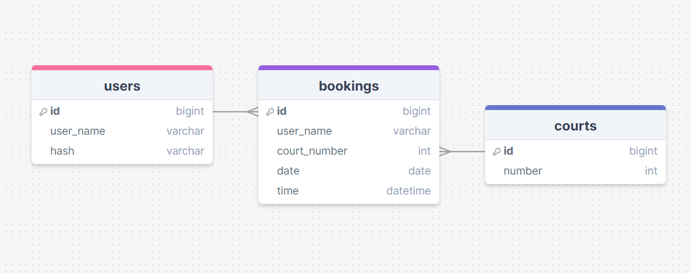

# The Design of a Database-Driven Web Application for NCEA Level 3

Project Name: **Richmond hall booking app**

Project Author: **YUUKI HEISSSNER**

Assessment Standards: **91902** and **91903**

-------------------------------------------------

## System Requirements

### Identified Need or Problem

There is a problem where the current hall booking website does not work on mobile devices even though most of the bookings happen on mobile. you can also not make accounts your self so every time someone wants to make an account they need to call the hall owner and ask to make an account. I will be solving this problem by making a website/app that is easier to navigate and use on mobile, and also making it so anyone can make an account on their own devices. 

### End-User Requirements

The Richmond hall owner and usual users are the clients. The hall owner has an website set up for the usual users to book the courts with their accounts but whenever someone new wants to create an account they have to call the hall owner to open an account. The usual users also struggle to use this website on their mobile devices.  
The hall users will want to see clearly what times on what dates they can book, they will also want to easily navigate through the website. For example, they should be able to go the next week, next day. they should also be able to delete their booking too. 
The hall owner will like so the usual users and other users can use this website without doing anything himself.  

### Proposed Solution

A website/app that is better than the current one on the sides of design and management. the website/app will include: 

clients should be able to do: 
 - create an account 
 - log in/out of their account 
 - view what dates they can book
 - Delete/cancel their bookings 

what the all owner should be able to do:
- see all accounts registered
- view what dates are booked
- delete accounts 
 

-------------------------------------------------

# Relevant Implications

## Usability  

### Explanation 
The usability implications of a digital technology or digital outcome (e.g. a website) relate to how easy it is to use for the end-user, without the need for help or guidance.

### Relevance  
I will need to design my website as simple as possible because the end users can be anyone and may come from all walks and will have a wide range of skills on using websites. I will need to make sure that the system is usable to anyone even if they aren't skilled with IT. 

### Impact/ Considerations

As I design my website I will refer back to Nielson's heuristics and make sure that the websites UI meets the heuristics requirements as much as possible.

I will make sure the UI is the most minimalistic and has all the functions it should have. everything will be clear on what does what. all the steps to book a court should be straight forward and simple, it should only take a few clicks to book a court. 

## Privacy  

### Explanation
The privacy implications of a digital technology or digital outcome (e.g. a website) relate to protecting the privacy of end-users and their data.

### Relevance
Because there will be so many accounts that people make i need to make sure that all their details are stored safely in the database. 

### Impact/ Considerations  
As I work on the privacy and security i will refer back to Nielson's heuristics and make sure that I can make the website as secure and private as possible.

I will store the users data in an data base where their passwords will be hashed so even if there is an data base breach the bad actor will only be able to access the users username. 

## Accessibility  
 
### Explanation
The accessibility implications of a digital technology or digital outcome (e.g. a website) involve ensuring it is available to, and can be used by, all end-users, regardless of their abilities.

### Relevance
This website will be accessed from different devices and people. I will base my UI to be able to be used on mobile devices but also make it functional on desktops. 

### Impact/ Considerations  
As I design my systems UI I will be focused on the mobile devices UI but i will also make so it is usable on desktops too. 
I will need to consider people who have colour blind, impaired vision, and dyslexia will be using this app/website too so will keep all the colours simple so it is accessible to all people.  

## Aesthetic

### Explanation
The aesthetic implications of a digital technology or digital outcome (e.g. a website) relate to how it looks in terms of design.

### Relevance
My website will need the simplest aesthetic as possible so it is easy to navigate so that the user can finish what they want to do fast. The font will be easy to read for all people. I will need make sure that the website is still appealing but simple. 

### Impact/ Considerations  
I will make the websites aesthetic suit its purpose of the hall booking service. Which means it will be simple and only a few colours. I will also use colours to maybe categorise things so users know what they are doing that moment.

## Functionality

### Explanation
The functionality implications of a digital technology or digital outcome (e.g. a website) relate to how well it works for the end-user, in terms of meeting its intended purpose.

### Relevance
With this website it is important for it to function as an hall booking app. which means all users should be able select a date then time to book and other users should not be able to book times that have already have been booked.

### Impact/ Considerations
It will be important to have functions that come up with an error message if the users is trying to put invalid dates, times, or booking a time which has already been booked. It will need the original purpose of being simple and easy to navigate so all the navigations should take the users where they should. All the functions should work as the user expects and should have no bugs or crashes. 

-------------------------------------------------

## Relevant User Experience (UX) Principles

### Visibility of System Status

Visibility of System Status is all about Keeping users informed about what is going on.

This UX principle is relevant to my website/app because the users will always need to be informed on what step they are to booking a court.

The website/app will always have an indicator on top of the screen on what the user is doing. 

### User Control and Freedom

User Control and Freedom is about giving users a clear 'emergency exit' to get out of unwanted states.

This UX principle is relevant to my website/app because the users should be able to cancel their bookings and always have an back button so they can undo something if they made an mistake. 

The website/app will have cancel options for hall booking times so even if the users book the wrong time or date they can just cancel that booking and create a new one. The website will always have an back button so they can go back at any time they want. 

### Match Between System and the Real World

Match Between System and the Real World UX is about using words, images and concepts that are familiar to the user which reflect real-world experiences.

This UX is relevant to my website because there will be a lot of users using this website so all the features should be similar to the real world so users understand whats happening and what they are doing. 

The website will have courts 1 to 4 designed to look similar to the real courts so users know what courts they are booking. All the error messages will be in red to match everything else in the real world so the users know there was an error. 

### Error Prevention
Error Prevention is about preventing users from making errors if possible. Or at least give users a confirmation option before they commit to an irreversible action.

This UX is relevant to my project because it will be important for users to select invalid dates, times. It is also important to let users know that it is invalid to book courts that are already booked. 

The website will need error messages for when users are trying to select an invalid date or trying to book an court that has already been booked. 

### Aesthetic and Minimalist Design

Aesthetic and Minimalist Design is about Keeping the UI a simple as possible, focussing on the current user action. The website should only show necessary information at any stage and avoid overwhelming the user with useless information.

This UX is relevant to my project because the websites purpose is about being able to book courts easily, fast and avoiding any6 extra steps. 

The website will have the minimalist design and simple colours and the least amount of steps as possible so the users can finish what they want to do as quick as possible and not be overwhelmed. 

-------------------------------------------------

## Final System Design

### Database Structure

### User Interface Design

-------------------------------------------------

## Completed System

### Database Structure

I removed the idea of having a court table because it was unnecessary to have a different table when I can just insert the court number into to the bookings table.

### User Interface Design

I had to have the bookings in boxes because I ran out of time on doing the grid view for the bookings. 

-------------------------------------------------

## Review and Evaluation

### Meeting the Needs of the Users

I met the user requirement of being able to easily navigate on mobile and desktop view. 

### Meeting the System Requirements

I met the system requirements being able to, log in/out, sign up, create a booking, and view other peoples bookings to see when they can book.

I could not get the functions of the admin log in working on time and users being able to delete/cancel their bookings. 

### Review of Usability  

Replace this text with brief notes showing how the implication was addressed in the final outcome. Accompany the notes with screenshots / other media to illustrate specific features.

### Review of Privacy  

Replace this text with brief notes showing how the implication was addressed in the final outcome. Accompany the notes with screenshots / other media to illustrate specific features.

### Review of Accessibility 

Replace this text with brief notes showing how the implication was addressed in the final outcome. Accompany the notes with screenshots / other media to illustrate specific features.

### Review of Visibility of System Status

Replace this text with brief notes showing how the UX principle was addressed in the final outcome. Accompany the notes with screenshots / other media to illustrate specific features.

### Review of Error Prevention

Replace this text with brief notes showing how the UX principle was addressed in the final outcome. Accompany the notes with screenshots / other media to illustrate specific features.

### Review of Aesthetic and Minimalist Design

Replace this text with brief notes showing how the UX principle was addressed in the final outcome. Accompany the notes with screenshots / other media to illustrate specific features.
