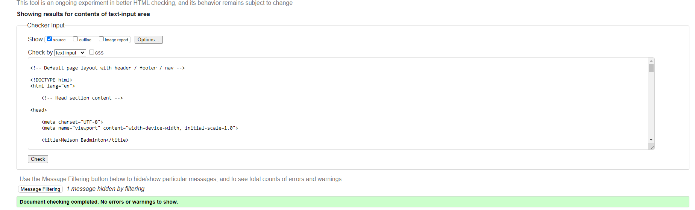

# Development of a Database-Driven Web Application for NCEA Level 3

Project Name: **Richmond hall booking app**

Project Author: **YUUKI HEISSNER**

Assessment Standards: **91902** and **91903**

-------------------------------------------------

## Design, Development and Testing Log

### 17/05/2024

I am designing my database and navigations of the website/app.  

This will be the general flow of the website for users. 

### 23/05/2024

The admin will have a different log in, the admin will be able to the users and delete, and add users, they can also delete booking if needed when the admin logs in the admin flow will look like this. 

My end user was happy on all the functions I had on my flow diagram. 

### 24/05/2024

I started working on my UI on figma to start testing the layouts and colours. 

>

### 28/05/2024

I have been working on figma designing my UI. 

### 31/05/2024

I have completed the UI design on figma and now waiting on a response frm my end user on the functions and design. 

the basic functions are that users can login/sign up/logout. they can go straight to the bookings and choose a time and book an court. 

### 07/06/2024

I made some more variations of my app/website so that there are more options for my end-user if they don't like the initial design.   

### 11/06/2024

I got my user feedback and this is what they said. 

I made the footer a darker colour to add variations and to keep a nice balance to my app/website as my end user said so. when I added the badminton logo to the website I decided to also make a version where the footer is orange to match the logo, so i will ask my end user on which one they think is better. 

You are able to see the changes I made based on my feedback below. 

### 14/06/2024

I started to make my website and I am focusing on the functions first before I start my design side of the project.

### 20/06/2024
I finished making the login, logout, and sign up functions working. users will be able sign up by them self.

### 09/08/2024 

I worked on my css on only for mobile and I attempted to make it as the figma design. 

### 13/08/2024 

I have added the functions next day, previous day, next week, previous week by using the offset function. 

### 16/08/2024 

When I showed my end user the complete website they said I would not need to print out the username because i already had the name of the user who is booking, and that I don't need to print out the date because it already says the current date on top of the screen, this will help it being more simple and easier to view. 

And here is the updated page. this helps the list to be smaller and easier to view.

### 15/08/2024

I did not have time to make the admin login functions, and the grid to see the bookings. 
My End user said the list looked fine and maybe better than the grid because it is more easier to view. 

### 23/08/2024

Here is a video of me testing all the functionality's of the website.

https://mywaimeaschool-my.sharepoint.com/:v:/g/personal/yheissner_waimea_school_nz/EdhTVebe54xHoI6AjlaTqwoBzhSS1WLKJ6Mw3R92sDdKdw?nav=eyJyZWZlcnJhbEluZm8iOnsicmVmZXJyYWxBcHAiOiJTdHJlYW1XZWJBcHAiLCJyZWZlcnJhbFZpZXciOiJTaGFyZURpYWxvZy1MaW5rIiwicmVmZXJyYWxBcHBQbGF0Zm9ybSI6IldlYiIsInJlZmVycmFsTW9kZSI6InZpZXcifX0%3D&e=dTf0rf 

